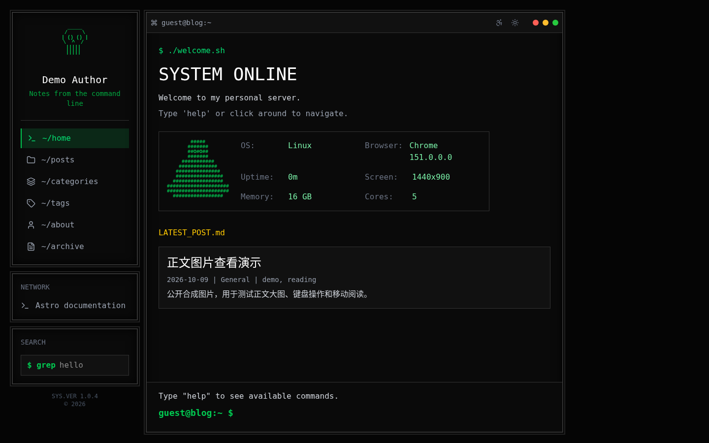

# Terminal Blog

[中文](README.md) · [Setup](docs/getting-started.md) · [Contributing](CONTRIBUTING.md) · [MIT License](LICENSE)

[](https://github.com/KiritoKing/term-style-blog/actions/workflows/ci.yml)

A reusable **Astro 7, React 19, TypeScript and Tailwind CSS 4** blog theme with a retro terminal interface. Start with a neutral identity and synthetic Markdown posts, then customize one typed `site.config.ts` file. Comments and inherited owner redirects are disabled by default.

[Public demo](https://public-demo.term-style-blog-demo.pages.dev/) · [Image viewer demo](https://public-demo.term-style-blog-demo.pages.dev/posts/image-lightbox-demo/). This independent Pages project serves only neutral synthetic content; the personal blog and protected review preview remain separate.



## Features

- Terminal navigation with `help`, `ls`, `cd`, `cat` and `grep`, alongside ordinary links.
- Dark/light themes, reading mode, responsive layouts, article TOC, code highlighting and Mermaid.
- Native-dialog image viewer with keyboard dismissal, zoom, pan and fit-to-screen controls.
- Pagefind search, categories, tags, archives, pagination, RSS, sitemap and SEO metadata.
- Typed site identity/About/network configuration; optional Giscus and historical redirects.
- Static Markdown/Obsidian-style content with strict publication validation; no CMS account required.

## Quick start

Use Node.js **22.12+ or 24** and **pnpm 10.28.0**. Local development needs no Obsidian, Notion, Cloudflare or credentials.

```sh
git clone https://github.com/KiritoKing/term-style-blog.git
cd term-style-blog
corepack enable
corepack prepare pnpm@10.28.0 --activate
pnpm install --frozen-lockfile
pnpm dev
```

Open the address printed by Astro, usually `http://localhost:4321`. If Corepack is absent, use an installed pnpm 10.28.0.

Edit the `template` profile in [`site.config.ts`](site.config.ts): title, author/public author URL, origin, terminal username/hostname, About, network links, content license, optional Giscus, redirect map and remote-image hosts. Replace `src/content/blog/` and the favicon. The existing `chlorine` profile preserves the original owner's personal site; it is selected only by that owner's protected publication build.

```sh
pnpm test
pnpm test:deployment
pnpm check
pnpm build
pnpm preview
```

Search requires the Pagefind index generated by `pnpm build`. Browser tests use Chromium: `pnpm exec playwright install chromium`, then `pnpm test:e2e`. See [CONTRIBUTING](CONTRIBUTING.md).

## Write and deploy

The bundled examples live in `src/content/blog/`. Every post needs a stable slug and complete publication metadata; see the [content contract](docs/content.md). To build a directory containing only your approved Markdown:

```sh
SITE_URL=https://blog.example.org \
CONTENT_DIR=/absolute/path/to/published \
PUBLIC_DEPLOYMENT_ENV=production \
STRICT_CONTENT_ASSETS=1 \
pnpm build:content
```

Upload `dist/` to a static host. Use `PUBLIC_DEPLOYMENT_ENV=preview` for noindex review builds. These crawler directives are not access control. The owner's private immutable-snapshot publication workflow remains gated to the owner repository/main and is optional infrastructure, not required to use the theme. Forks should configure their own host rather than remove those guards. [Setup and hosting](docs/getting-started.md) · [Owner publication pipeline](docs/publication-pipeline.md).

## Screenshots and catalogue

Screenshots show only synthetic examples: [article/light](docs/images/article-light.png), [mobile/dark](docs/images/mobile-dark.png), [viewer/light](docs/images/viewer-light.png). Attribution is in [NOTICE](NOTICE.md).

[Astro Themes submission material](docs/astro-theme-submission.md) contains a description, setup and asset checklist. The independent anonymous demo is ready. The protected review preview remains separate; Portal login/OAuth/submission/admin review belong to the maintainer.

## License and contribution

Original source, documentation, demo posts and synthetic demo assets use [MIT](LICENSE); retain the copyright and third-party notices. Live owner articles keep their separately stated content license. Names, logos and external media are not relicensed by this repository. [NOTICE](NOTICE.md) · [SECURITY](SECURITY.md) · [CODE_OF_CONDUCT](CODE_OF_CONDUCT.md).

Focused fixes and theme usability improvements are welcome. The theme is a static blog rather than a CMS. Archived specs and agent reports preserve development history; older Notion plans do not describe the current Markdown content source.
