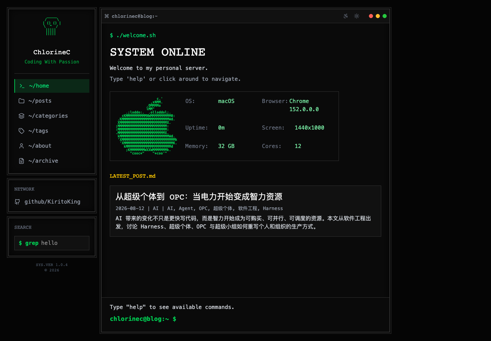

# term-style-blog

[English](README.en.md) · [在线博客](https://chlorinec.top) · [使用与部署](docs/getting-started.md) · [贡献指南](CONTRIBUTING.md)

[](https://github.com/KiritoKing/term-style-blog/actions/workflows/ci.yml)
[](LICENSE)

一个带终端交互的静态博客，使用 **Astro、React、TypeScript 和 Tailwind CSS**。这里是 [ChlorineC 的个人博客](https://chlorinec.top)的源代码：保留像素字体、终端窗口和命令行交互，同时认真处理长文阅读、移动端布局和内容发布。



这是一个持续维护的个人站点。欢迎学习、修改和 fork；配置仍围绕作者自己的博客组织，没有后台、多租户或通用 CMS 管理界面。

## 能做什么

- **终端交互**：`help`、`ls`、`cd`、`cat`、`grep` 等命令，配合常规链接导航。
- **阅读体验**：深浅主题、阅读模式、响应式布局、文章目录、代码高亮、Mermaid 图表。
- **内容发现**：分类、标签、归档、分页和 Pagefind 全文搜索；Giscus 评论。
- **发布能力**：Markdown / Obsidian 内容、稳定 slug、历史 URL 重定向、RSS、sitemap、robots、SEO 元数据。
- **严格门禁**：缺失分类或摘要、`Uncategorized`、重复 slug、冲突标记和未准出文章会阻止发布构建。

## 五分钟启动

使用 **Node.js 22.12+ 或 24** 和 **pnpm 10.28.0**。仓库包含演示文章，本地启动不需要 Obsidian、Notion、Cloudflare 或任何密钥。

```sh
git clone https://github.com/KiritoKing/term-style-blog.git
cd term-style-blog
corepack enable
corepack prepare pnpm@10.28.0 --activate
pnpm install --frozen-lockfile
pnpm dev
```

打开终端显示的地址，默认是 `http://localhost:4321`。如果你的 Node.js 安装未包含 Corepack，可使用已经安装的 pnpm 10.28.0。

```sh
pnpm test                 # 单元测试
pnpm test:deployment      # 内容快照与部署边界测试
pnpm check               # 内容校验、Astro / TypeScript 检查
pnpm build               # 演示文章构建 + Pagefind 索引
pnpm preview             # 预览 dist
```

搜索依赖构建时生成的索引，请在 `pnpm build` 后通过 `pnpm preview` 验证。完整浏览器测试见[贡献指南](CONTRIBUTING.md)。

## 写文章与发布

默认演示文章在 `src/content/blog/`。接入自己的文章时，使用 vault 外的发布快照或仅包含准出文章的目录：

```sh
CONTENT_DIR=/absolute/path/to/published \
PUBLIC_DEPLOYMENT_ENV=preview \
STRICT_CONTENT_ASSETS=1 \
pnpm build:content
```

文章需要 `title`、`slug`、`status`、`date`、`category`、`tags`、`summary` 和 `publish.target: blog`；完整示例见[内容约定](docs/content.md)。`CONTENT_DIR` 目录内的每篇 Markdown 都参与构建，不能把整个 vault 指向它。

当前个人发布链路是：

```text
Obsidian Sync → Hermes 只读导出 → 独立 Git 内容快照
             → GitHub Actions 校验与构建 → 受保护预览逐页验收 → 正式站
```

活跃 vault 以 Markdown 为事实源，Git 不向它反向同步。博客源代码仓库不包含真实 vault 或部署密钥。正式站已上线；启用自动生产后，已准出文章的保存、更新和普通删除通过逐页验收后更新正式站。未配置实例仍默认关闭自动生产，失败与回退规则见[发布链路](docs/publication-pipeline.md)。

**Fork 后先改个人配置再部署。** 域名、作者信息、Giscus、历史路径以及发布 workflow 都包含本站配置；不会因为 fork 就自动成为你的站点。详见[配置清单与部署边界](docs/getting-started.md)。

## 项目结构

| 路径 | 用途 |
| --- | --- |
| `src/pages/`、`src/layouts/` | 静态路由与页面结构 |
| `src/components/`、`src/styles/` | 终端界面、交互与样式 |
| `src/content/blog/` | 本地可运行的演示文章 |
| `src/lib/`、`src/data/` | 内容处理、站点身份与页面数据 |
| `scripts/`、`tests/` | 校验、重定向、部署与浏览器验收 |
| `openspec/`、`.agent/` | 行为规格与历史实现记录 |

`openspec/changes/archive/`、`.agent/` 和旧交付计划保留开发历史，其中的旧 Notion 方案不代表当前内容源；当前入门以本文和 `docs/content.md` 为准。

## 参与与许可

小范围修复、阅读体验和文档改进都欢迎。新功能请先通过 Issue 说明使用场景；本项目优先服务个人博客，不承诺成为通用主题平台。参见[贡献指南](CONTRIBUTING.md)和[行为准则](CODE_OF_CONDUCT.md)。安全问题请走[私密报告入口](SECURITY.md)。

原创代码、示例和文档使用 [MIT License](LICENSE)。第三方依赖、字体、图标及 Astro 起始素材遵循各自许可证，见 [NOTICE](NOTICE.md)。在线文章遵循站点标注的内容许可，不能把源码的 MIT 许可延伸到外部文章、截图中的内容或第三方素材；作者名称和个人身份也不是 fork 必须沿用的品牌。

[发布触发与执行角色](docs/publication-pipeline.md)
