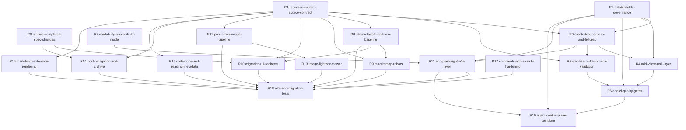
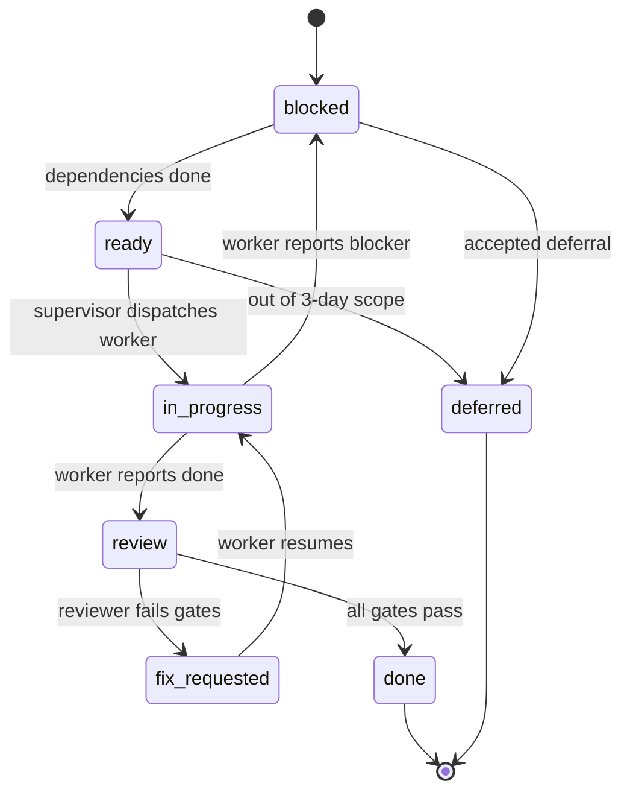
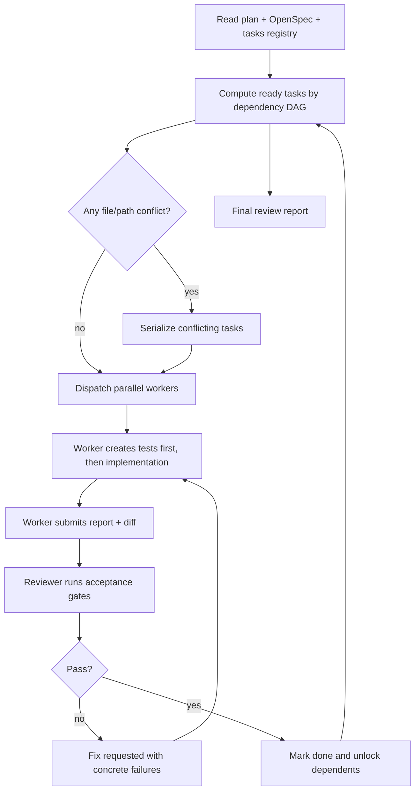

# AI Agent Delivery Plan

本文档用于把终端风格博客在三天内交给 AI agent 执行的工作拆清楚。它不是正式 OpenSpec change，只是一个控制面计划：列出需求、优先级、依赖关系、迭代顺序和验收边界。

## 目标

- 在保留终端/像素美术风格的前提下，把项目打磨成可正式上线的博客。
- 补齐从旧博客框架迁移到当前框架所需的基础功能。
- 建立完整 TDD 与 CI 质量门禁，提高 AI 自动交付的可验收性。
- 形成可由主管 agent 分发、追踪、验收的任务结构。

## 当前基线

### 已有功能

- Astro 5 + React island + TypeScript strict + Tailwind 4。
- 终端 Shell 布局：Sidebar、TopBar、ContentFrame、TerminalPanel。
- 终端命令：`ls`、`dir`、`cd`、`pwd`、`cat`、`clear`、`echo`、`whoami`、`date`、`help`、`grep`。
- 文章列表、文章详情、分类、标签、分页。
- slug 优先的文章路由 change 已完成但未归档。
- 首页系统信息、about 配置、network 配置 change 已完成但未归档。
- Notion 内容层已接入，当前 `src/content.config.ts` 实际使用 Notion loader。
- Pagefind 搜索页面与 postbuild 索引脚本。
- Giscus 评论组件与自定义终端主题 CSS。
- 基础文章目录 TOC。
- 深浅色切换和现有无障碍字体模式。

### 当前风险

- OpenSpec 同时存在 Markdown 内容层和 Notion 内容层的 MUST 规格，当前实现偏 Notion，规格冲突需要先解决。
- `pnpm astro check` 会因为 Notion token 无效被阻断，构建和检查基线不稳定。
- 没有可执行测试体系：无 Vitest、无 Playwright、无 CI、无 harness。
- README 中“大图查看功能”仍未完成。
- 旧框架迁移所需的 RSS、sitemap、robots、SEO、URL redirects、封面图、归档、前后篇等能力尚未补齐。
- 当前美术风格较强，可读性、可操作性、可访问性还需要系统优化。

## 需求总表

| ID | 虚拟 change | 优先级 | 目标 | 主要验收 |
| --- | --- | --- | --- | --- |
| R0 | `archive-completed-spec-changes` | P0 | 将已完成的 slug 路由、首页配置 change 归档或同步到基线 | OpenSpec 主规格不再滞后 |
| R1 | `reconcile-content-source-contract` | P0 | 明确 Notion-only、Markdown-only 或双源内容策略 | 内容层规格无冲突；页面和测试有统一数据模型 |
| R2 | `establish-tdd-governance` | P0 | 在 AGENTS 与 OpenSpec 规则里写入 TDD 约束 | 每个新 change 必须包含测试设计和测试任务 |
| R3 | `create-test-harness-and-fixtures` | P0 | 建立内容 fixture、env mock、Notion 兜底、测试工具 | check/test/build 不依赖真实 Notion 凭据 |
| R4 | `add-vitest-unit-layer` | P0 | 引入 Vitest 单测层 | 分页、路由、内容归一化、终端命令逻辑有单测 |
| R5 | `stabilize-build-and-env-validation` | P0 | 稳定 `astro check`、`build` 和错误提示 | 本地与 CI 可重复执行基础验证 |
| R6 | `add-ci-quality-gates` | P1 | 建立 CI 阻断 | install、check、unit、build 必跑；后续 e2e 接入 |
| R7 | `readability-accessibility-mode` | P1 | 扩展无障碍/阅读模式 | 可关闭闪烁、扫描线、像素字体；尊重 reduced motion；键盘可用 |
| R8 | `site-metadata-and-seo-baseline` | P1 | 正式博客 SEO 基线 | 动态 title/description、OG/Twitter、JSON-LD |
| R9 | `rss-sitemap-robots` | P1 | 发布基础设施 | 生成 RSS、sitemap、robots |
| R10 | `migration-url-redirects` | P1 | 旧 URL 迁移 | 旧路径 301 到新文章路径，带测试 |
| R11 | `add-playwright-e2e-layer` | P1 | 引入 Playwright e2e | 核心路由、终端导航、a11y 模式可端到端验证 |
| R12 | `post-cover-image-pipeline` | P2 | 封面图与 Notion 图片处理 | 列表/详情支持封面，远程图片规则稳定 |
| R13 | `image-lightbox-viewer` | P2 | 大图查看 | 正文图片和封面可放大查看，键盘可关闭 |
| R14 | `post-navigation-and-archive` | P2 | 上一篇/下一篇与归档页 | 文章详情有前后篇；归档按年份组织 |
| R15 | `code-copy-and-reading-metadata` | P2 | 代码复制、阅读时间、摘要 | 代码块一键复制；文章显示阅读时间/字数/摘要 |
| R16 | `markdown-extension-rendering` | P3 | 内容表达增强 | KaTeX、admonition、GitHub card、标题锚点 |
| R17 | `comments-and-search-hardening` | P3 | 搜索和评论硬化 | Giscus origin 限制；搜索元数据与空状态更可靠 |
| R18 | `e2e-and-migration-tests` | P3 | 完整回归套件 | URL 迁移、搜索、评论加载范围、可访问性模式纳入回归 |
| R19 | `agent-control-plane-template` | P0 | 设计主管 agent 分发/验收机制 | 可根据依赖图派发任务、收集结果、出 review 报告 |

## 依赖关系



## 三天迭代计划

### Day 1: 基线和控制面

目标：先让 AI 交付可控、可测、可验收。

- 完成 R0：同步/归档已完成 OpenSpec change，修正 TOC 文档状态。
- 完成 R1：决定内容源策略，建议先用 Notion-only，Markdown fixture 仅用于测试和本地 fallback。
- 完成 R2：把 TDD 写入 AGENTS 与 OpenSpec 规则。
- 完成 R3：建立测试 fixture/harness，避免真实 Notion token 阻断开发。
- 完成 R4：引入 Vitest 单测，先覆盖纯逻辑。
- 完成 R5：稳定 `astro check` 和 `build`。
- 输出 R19 第一版：主管 agent 如何派发任务、如何验收、如何写 review。

Day 1 验收：

- `pnpm test:unit` 可运行。
- `pnpm astro check` 或等价 check 不再被无效 Notion token 阻断。
- 后续 change 的 tasks 必须包含测试任务。

### Day 2: 正式上线基础

目标：补齐正式博客上线的最低能力。

- 完成 R6：CI 初版，阻断 install/check/unit/build。
- 完成 R7：可读性与无障碍模式。
- 完成 R8：SEO metadata 与 JSON-LD。
- 完成 R9：RSS、sitemap、robots。
- 完成 R10：旧 URL redirects。
- 完成 R11：Playwright e2e 基础层。

Day 2 验收：

- CI 可跑通。
- 首页、列表页、文章页、分类/标签页有基本 e2e。
- 可访问性模式有 e2e 或 axe smoke test。
- 迁移 URL 有自动测试。

### Day 3: 阅读体验与收尾

目标：补齐旧框架核心体验，输出最终 review 报告。

- 完成 R12：文章封面与 Notion 图片处理。
- 完成 R13：大图查看。
- 完成 R14：归档页、上一篇/下一篇。
- 完成 R15：代码复制、阅读时间、摘要。
- 视时间完成 R16/R17；若不足，输出清晰 deferred list。
- 完成 R18：把关键迁移、搜索、可访问性、图片行为纳入回归。
- 主管 agent 输出 final review：完成项、未完成项、测试证据、风险、后续建议。

Day 3 验收：

- `pnpm ci` 或等价总命令通过。
- 关键页面 Playwright 截图或 DOM 断言通过。
- 旧链接迁移、RSS、sitemap、SEO、可读性模式均有测试或明确人工验收记录。

## TDD 规则草案

### 工作区规则

- 所有功能改动必须先明确测试策略。
- 能单测的逻辑必须先写 Vitest，不能只靠 e2e。
- 涉及页面、路由、交互、可访问性的需求必须有 Playwright 或明确的替代验收。
- AI 交付报告必须列出：新增/更新测试、执行命令、失败项、未测风险。
- 没有测试的变更默认不得进入 P1/P2 实现，除非在 tasks 中写明原因。

### OpenSpec 规则

- `proposal.md` 必须包含 Test Impact。
- `design.md` 必须包含 Test Strategy 和 Testability。
- `specs/<capability>/spec.md` 的关键场景必须可映射到 unit、integration 或 e2e。
- `tasks.md` 必须包含测试任务，并且测试任务应按 TDD 排在实现任务之前。
- 任务完成必须附带可执行验证命令。

### 测试分层

| 层级 | 工具 | 覆盖 |
| --- | --- | --- |
| Unit | Vitest | 分页、路由 helper、内容归一化、终端命令解析 |
| React island | Vitest + Testing Library + happy-dom | TerminalPanel、TopBarControls、Comments |
| E2E | Playwright | 页面路由、终端导航、搜索、TOC、无障碍模式 |
| A11Y | Playwright + axe | reduced motion、键盘焦点、对比度、跳转链接 |
| Build | pnpm scripts | Astro check、build、Pagefind postbuild、env fallback |

## 主管 Agent 控制面草案

主管 agent 不直接实现所有功能，而是维护一个任务图、派发子任务、验收结果。

### 职责

- 读取本文档和 OpenSpec 基线。
- 将每个虚拟 change 转成真实 OpenSpec change 或实现任务。
- 根据依赖图只派发 ready 状态任务。
- 为每个任务指定 acceptance checklist、测试命令、影响范围。
- 合并前执行验收：代码审查、测试、截图、构建。
- 维护状态板：blocked、ready、in progress、review、done。
- 最后输出 review 报告。

### 子任务上下文包

每个子 agent 开始前必须拿到：

- 任务 ID 和目标。
- 依赖完成状态。
- 相关 OpenSpec spec/change。
- 允许编辑范围。
- 必须新增/更新的测试。
- 验收命令。
- 回报格式。

### 回报格式

```text
Task: Rxx <change-name>
Status: done | blocked | partial
Files changed:
Tests added/updated:
Commands run:
Result:
Risks:
Follow-ups:
```

## 待调研问题

- 多 agent control plane 社区通常怎么建模任务图、状态和验收？
- 主管 agent 如何分发子任务：多线程、多 worktree、多 PR，还是单仓多分支？
- 如何避免子 agent 互相踩文件和重复改动？
- 如何让验收 agent 独立于实现 agent，降低自证风险？
- 有哪些可落地的工程模板适合当前 Codex + OpenSpec + pnpm/Astro 项目？

## 调研结论

### 社区主流模式

| 方案 | 核心做法 | 对本仓库的启发 |
| --- | --- | --- |
| OpenAI Agents SDK | 两类常见模式：manager 把 specialist agent 当工具调用；handoff 把对话控制权交给 specialist。也支持用代码编排顺序、并行、评估循环。 | 本仓库的主管 agent 应保持中央控制，worker 只处理有边界的任务；验收可以用 evaluator/reviewer 循环。 |
| LangChain/LangGraph | subagents 模式强调中央 supervisor、上下文隔离、并行调用；Graph API 适合显式状态、条件分支、并行汇合和团队协作可视化。 | 需求依赖图应该是显式 DAG，不要只靠 prompt 记忆；每个 worker 拿最小上下文包。 |
| AutoGen AgentChat | SelectorGroupChat 适合动态选择下一个 agent；GraphFlow 用有向图控制顺序、并行、条件分支和循环，但当前标注为 experimental。 | 对三天冲刺来说，GraphFlow 的模型很有参考价值，但不要在仓库里引入它作为硬依赖。 |
| CrewAI | hierarchical process 由 manager agent 分派任务并验证结果；process 层负责顺序或层级执行。 | 主管职责应明确包含 task assignment、result validation 和 sequential progression。 |

### 对本项目的判断

三天内最稳的方案不是引入一个新的多 agent 框架，而是在现有 Codex/OpenSpec/pnpm/Git 工作流上建立轻量控制面：

- 任务图由本文档和后续真实 OpenSpec changes 承载。
- 状态由一个可版本化的任务注册表承载，建议后续落在 `.agent/tasks.yaml` 或 `docs/agent-task-registry.md`。
- 主管 agent 负责计算 ready 任务、开子线程/分支/worktree、下发上下文包、收集报告、触发验收。
- 子 agent 每次只做一个 change，必须先写或更新测试，再实现。
- reviewer agent 或主管用同一套 CI/harness 验收，不接受“实现 agent 自己说通过”作为最终证据。

## 落地工程模板

### 推荐目录

```text
docs/
  ai-agent-delivery-plan.md
  agent-control-plane.md          # 后续从本文档拆出的执行手册
.agent/
  tasks.yaml                      # 任务状态、依赖、负责人、分支、验收命令
  prompts/
    supervisor.md                 # 主管 agent 提示词
    worker.md                     # 子 agent 通用提示词
    reviewer.md                   # 独立验收提示词
  reports/
    Rxx-change-name.md            # 每个任务的执行报告
scripts/
  agent/
    ready-tasks.ts                # 计算可派发任务
    validate-task.ts              # 校验单任务报告与验收命令
```

这套目录是后续要实现的模板，不在本次文档任务里真实创建。

### 任务状态机



### 主管执行流



### 任务注册表字段

```yaml
- id: R7
  change: readability-accessibility-mode
  priority: P1
  deps: [R2, R3, R5]
  status: ready
  owner_thread: null
  branch: codex/R7-readability-accessibility-mode
  allowed_paths:
    - src/components/**
    - src/styles/**
    - tests/e2e/**
  required_tests:
    - unit_or_component
    - playwright
    - axe_smoke
  acceptance_commands:
    - pnpm test:unit
    - pnpm test:e2e -- --grep accessibility
    - pnpm astro check
  report: .agent/reports/R7-readability-accessibility-mode.md
```

### 派发策略

- P0 只能串行或低并发执行，因为它们会改变测试基线、内容模型和控制面。
- P1 可以在 R2-R6 通过后并行，但 R7/R11、R8/R9/R10 之间要按依赖顺序推进。
- P2 适合并行分派，但要声明文件锁：图片管线 R12 与 lightbox R13 不能同时改同一图片渲染组件。
- P3 默认作为 stretch scope，除非前三层提前完成。

### 文件锁规则

- 每个任务必须声明 `allowed_paths`。
- 共享基础文件如 `src/content.config.ts`、`astro.config.mjs`、`package.json`、`pnpm-lock.yaml`、`src/layouts/**` 默认需要主管批准后才能并行修改。
- 若两个任务都要改同一共享文件，后一个任务必须等前一个任务完成并重新读取最新 diff。
- worker 不得做无关重构；发现依赖问题时回报 blocked，由主管拆新任务或调整依赖图。

### 验收门禁

| 阶段 | 必须检查 | 失败处理 |
| --- | --- | --- |
| Worker 完成前 | 本任务测试、相关 check、实现报告 | 不允许进入 review |
| Reviewer 验收 | diff review、测试命令、截图/DOM 证据、OpenSpec 一致性 | 标记 `fix_requested`，附失败命令和文件位置 |
| 合并前 | 总 CI、依赖任务状态、迁移 checklist | 不通过则阻塞后续依赖任务 |
| 三天收尾 | done/deferred 清单、风险、测试覆盖、未解决问题 | 输出 final review 报告 |

### 子 agent 提示词骨架

```text
你是本仓库的 worker agent，只处理一个任务。

Task: Rxx <change-name>
Priority:
Dependencies:
Allowed paths:
Relevant specs:
Required tests:
Acceptance commands:

规则：
1. 先读取相关 OpenSpec 和现有实现。
2. 先补测试设计和测试任务；能写测试时先写测试。
3. 只修改 allowed paths；需要越界时停止并报告 blocked。
4. 最终报告必须列出文件、测试、命令、风险和 follow-up。
```

### Reviewer 提示词骨架

```text
你是独立 reviewer agent，不实现功能，只验收。

输入：
- Task: Rxx <change-name>
- Worker report
- Git diff
- Acceptance commands

检查：
1. 是否满足需求和 OpenSpec。
2. 是否有对应测试，且测试层级合理。
3. 是否有无关改动或越界文件。
4. 是否通过验收命令。
5. 是否留下上线风险。

输出：
Status: pass | fix_requested | blocked
Findings:
Commands:
Residual risk:
```

## 三天托管节奏

### 第 0 小时：主管初始化

- 将本文档拆成真实任务注册表。
- 建立 R0-R6 的 OpenSpec changes。
- 定义统一测试命令名，例如 `pnpm test:unit`、`pnpm test:e2e`、`pnpm ci`。
- 明确第一批只派发 R0、R1、R2，不并行改测试基线。

### 第 1 天结束检查

- R0-R6 至少完成到可验收状态。
- 任何依赖真实 Notion 凭据的命令都必须有 mock/fallback。
- 主管输出 Day 1 review，决定 Day 2 能否并行进入 R7-R11。

### 第 2 天结束检查

- P1 上线基础必须具备：CI、SEO、RSS/sitemap/robots、redirects、可读性/a11y、Playwright smoke。
- 主管锁定 Day 3 范围，P3 只在 P2 完成后进入。

### 第 3 天结束检查

- 输出 final review 报告：
  - 完成需求与 deferred 需求。
  - 每项需求的测试证据。
  - 未解决风险和上线前人工检查项。
  - 建议下一轮 OpenSpec changes。

## 调研来源

- OpenAI Agents SDK: Agent orchestration, Agents, Handoffs, Guardrails。
- OpenAI business guide: A practical guide to building agents。
- LangChain/LangGraph docs: Multi-agent, Subagents, Graph API, Agent Server。
- Microsoft AutoGen docs: SelectorGroupChat, GraphFlow。
- CrewAI docs: Processes, Hierarchical Process。


## 2026-09-09 用户批准的个人博客迁移

B01 在独立 worktree 合并处理本次必要能力：Obsidian Markdown 生产内容源、历史链接、渲染、搜索评论、RSS/SEO、移动端阅读、离线 CI；保留终端风格和交互，通用配置与非必要增强延后。旧 Notion-only 假设在本 change 内正式更新规格。代码工作不依赖服务器同步恢复，生产接入须等待 S0。其余旧任务保留历史，B01 报告列出重叠能力结果，不将未验收任务直接标记完成。
