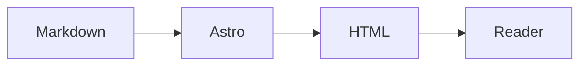

Welcome to **Terminal Blog**, a synthetic example of an Astro site with a terminal-inspired interface. These demo posts are original examples included under the repository's MIT license.

## Explore the shell

Use the navigation links, or type `help`, `ls`, `cat hello-world.md` and `grep pixel` into the prompt. The shell is a browser navigation aid; it does not execute operating-system commands.

## Write in Markdown

Astro renders article content to HTML. React islands provide the interactive terminal and controls. Replace the demo collection and edit `site.config.ts` to make the site your own.

```ts
const note = { title: 'Hello World', format: 'Markdown' };
console.log(note.title);
```

## Follow the flow



Search is built by Pagefind during `pnpm build`. You can also explore tags, categories and the archive, or open the image viewer demo to try zooming and panning.
